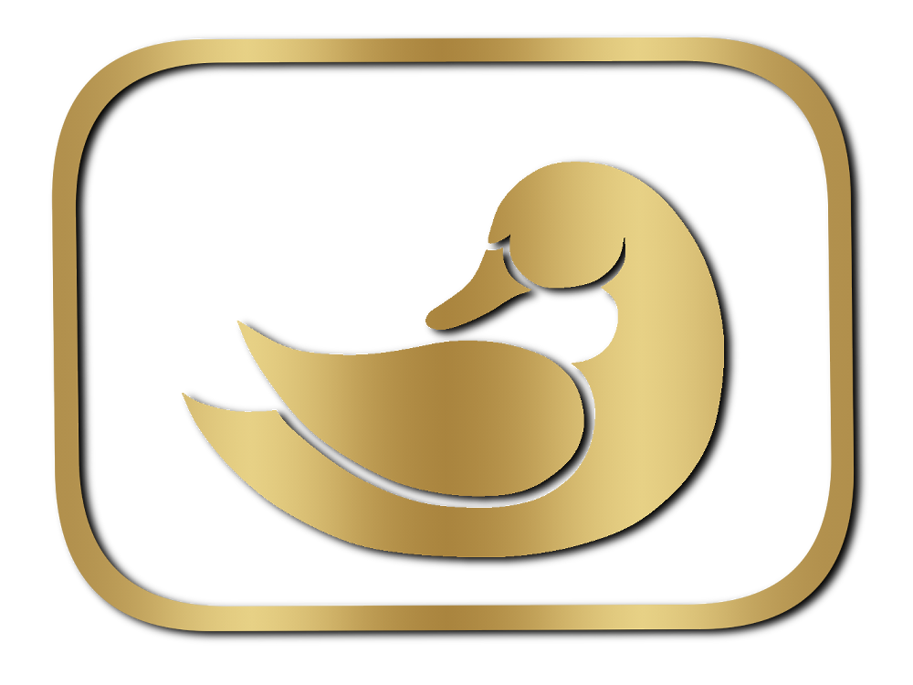
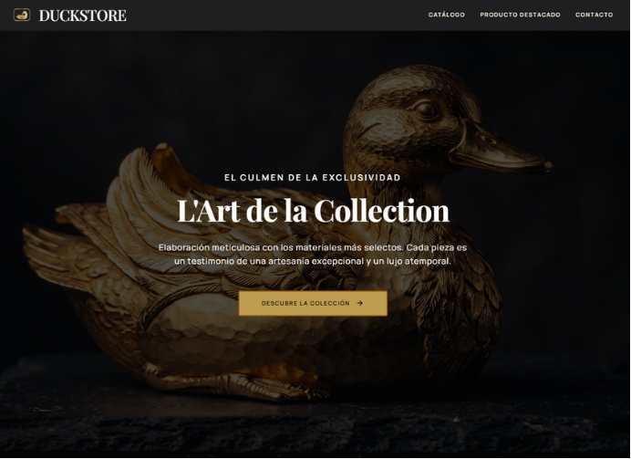
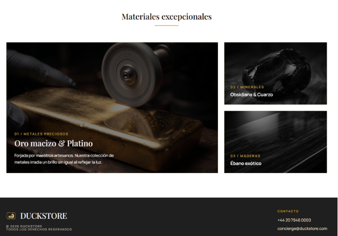

<div align="center">

  

  # 🦆 DUCKSTORE
  ### *L'Art de la Collection — Boutique Digital de Figuras Exclusivas*

  [](https://developer.mozilla.org/es/docs/Web/HTML)
  [](https://developer.mozilla.org/es/docs/Web/CSS)
  [](https://developer.mozilla.org/es/docs/Web/JavaScript)
  [](https://stitch.withgoogle.com/projects/14414595417036747126)
  []()

  <p align="center">
    <b>Una experiencia e-commerce de ultra-lujo que fusiona el arte pop y la alta joyería en piezas coleccionables elaboradas en metales preciosos y minerales nobles.</b>
  </p>

  [🌐 Prototipo Stitch](https://stitch.withgoogle.com/projects/14414595417036747126) • [📁 Repositorio GitHub](https://github.com/DesarrolloWebFullStackIA/DuckStore) • [👥 Equipo](#-miembros-del-equipo)

</div>

---

## 📖 1. Explicación del Proyecto

**DuckStore** es una boutique web de alta gama inspirada en firmas de lujo internacionales como *Rolex* y *Cartier*. El proyecto reimagina el icónico pato de goma transformándolo en una escultura artística de coleccionismo y alta joyería producida en ediciones estrictamente limitadas.

### 🌟 Propuesta de Valor y Características
* **Experiencia de Inmersión Visual**: Interfaz en modo oscuro con acentos dorados (`#D4AF37`), tipografía editorial de lujo (*Playfair Display*) combinada con una sans moderna y legible (*Manrope*).
* **Colección de Materiales Nobles**: Categorización cuidada de obras en *Metales Preciosos* (Oro macizo de 24k, Platino, Bronce patinado), *Minerales* (Obsidiana volcánica, Mármol de Carrara) y *Maderas Nobles* (Ébano exótico, Caoba centenaria).
* **Arquitectura Multipágina Completa**:
  * **`index.html` (Landing Page)**: Hero inmersivo, llamada a la acción principal y escaparate interactivo de categorías de materiales.
  * **`pages/catalog.html` (Catálogo)**: Grid responsivo de 6 obras artesanales con fichas detalladas y textos alternativos orientados a accesibilidad visual.
  * **`pages/product.html` (Ficha de Producto Destacado)**: Vista macro de la pieza *“Aurelian Mallard”* con especificaciones técnicas (artesano Elias Thorne, peso 1.2 kg, oro 24k) y botón de adquisición.
  * **`pages/contact.html` (Boutique & Contacto)**: Ubicación física en el Paseo de la Castellana (Madrid) con Google Maps embebido y formulario para comisiones privadas y consultas VIP.
  * **`presentacion.html`**: Presentación interactiva en diapositivas web sobre la arquitectura técnica, retos superados y hoja de ruta del proyecto.

---

## 📸 2. Capturas de Pantalla (Vista Previa)

<div align="center">

### 🌟 Portada & Hero Section


<br><br>

### 💎 Sección de Materiales Excepcionales & Footer


</div>

---

## 🎨 3. Acceso al Diseño y Prototipado en Stitch

El concepto visual, wireframing inicial y arquitectura de información fueron concebidos y prototipados en la herramienta **Stitch with Google**:

> 🔗 **Acceso directo al proyecto en Stitch:**  
> 👉 [**https://stitch.withgoogle.com/projects/14414595417036747126**](https://stitch.withgoogle.com/projects/14414595417036747126)

---

## 🛠️ 4. Herramientas y Stack Tecnológico

El desarrollo de DuckStore combinó tecnologías web estándar con herramientas de Inteligencia Artificial y diseño gráfico digital de última generación:


| Herramienta / Tecnología | Rol y Utilidad en el Proyecto |
| :--- | :--- |
| **🧵 Stitch with Google** | Planteamiento y conceptualización del diseño de la interfaz y wireframes interactivos. |
| **🤖 Gemini** | Generación de imágenes fotorrealistas de alta fidelidad para las piezas de joyería y materiales. |
| **🧠 Claude** | Asistencia técnica en la solución de errores, optimización y soporte de código. |
| **🖌️ Clip Studio Paint** | Diseño vectorial y realización artesanal del logotipo oficial de la marca. |
| **⚡ Squoosh** | Compresión y optimización de peso y formato de imágenes para carga ultra rápida. |
| **📊 Lighthouse** | Auditoría y optimización de rendimiento (Core Web Vitals), accesibilidad y buenas prácticas SEO. |
| **💻 Visual Studio Code** | Entorno de desarrollo integrado (IDE) para la edición del código fuente. |
| **🧱 HTML5 Semántico** | Estructura jerárquica limpia (`<header>`, `<nav>`, `<main>`, `<section>`, `<article>`, `<footer>`). |
| **🎨 CSS3 Puro & Modular** | Variables CSS globales, Flexbox, CSS Grid y diseño totalmente responsive sin frameworks pesados. |
| **⚙️ JavaScript (ES6+)** | Menú hamburguesa dinámico, efectos de navegación y validación de formularios. |

---

## 💻 5. Cómo Instalar y Ejecutar el Proyecto

Sigue estos sencillos pasos para clonar y ejecutar el proyecto en tu entorno local:

### 1️⃣ Prerrequisitos
* Tener instalado [Git](https://git-scm.com/) en tu sistema.
* Un navegador web moderno (Google Chrome, Firefox, Safari, Edge).
* *(Opcional)* [VS Code](https://code.visualstudio.com/) con la extensión **Live Server**.

### 2️⃣ Clonar el Repositorio
Abre tu terminal y ejecuta:
```bash
git clone https://github.com/DesarrolloWebFullStackIA/DuckStore.git
```

### 3️⃣ Acceder a la Carpeta del Proyecto
```bash
cd DuckStore
```

### 4️⃣ Lanzar el Proyecto
No requiere instalación de paquetes de Node ni dependencias pesadas:

* **Con Live Server en VS Code (Recomendado)**:
  1. Abre la carpeta `DuckStore` en Visual Studio Code.
  2. Haz clic derecho sobre el archivo `index.html` y selecciona **"Open with Live Server"**.
  3. Tu navegador se abrirá automáticamente en `http://127.0.0.1:5500`.

* **Directamente en el navegador**:
  * Haz doble clic en el archivo `index.html` o arrástralo a cualquier pestaña de tu navegador web.

---

## 📁 6. Estructura de Directorios

```text
DuckStore/
├── 📄 index.html                            # Página principal (Landing page y Hero)
├── 📄 presentacion.html                     # Deck de diapositivas web interactivo
├── 📄 DuckStore_Presentacion_Proyecto.pptx  # Presentación descargable en PowerPoint
├── 📄 README.md                             # Documentación del proyecto
├── 📁 pages/                                # Páginas secundarias del sitio
│   ├── catalog.html                         # Catálogo completo de figuras
│   ├── contact.html                         # Boutique física, mapa y contacto VIP
│   └── product.html                         # Ficha de producto destacado
└── 📁 src/                                  # Recursos y código fuente
    ├── 📁 css/                              # Hojas de estilo modulares
    │   ├── catalog-styles.css               # Estilos del catálogo
    │   ├── contact-styles.css               # Estilos de contacto y mapa
    │   ├── global-styles.css                # Variables CSS, reset y header/footer
    │   ├── product-styles.css               # Estilos de la ficha de producto
    │   └── styles-inicio.css                # Estilos específicos de la portada
    ├── 📁 img/                              # Logotipos, capturas y fotografías
    └── 📁 js/                               # Scripts interactivos
        └── global-js.js                     # Lógica de navegación y menú móvil
```

---

## 👥 7. Miembros del Equipo

Proyecto desarrollado colaborativamente por el equipo de **Desarrollo Web Full Stack con IA Generativa (Factoría F5 & Cruz Roja)**:
<div align="center">

  | Participante |
  | :--- |
  | **Adrián Tomás Tato López** |
  | **Jonathan Ruiz Palacios** |
  | **Sara Rodríguez Medina** |
  | **Alba Valentín Parreño** |
  | **José Caballero Stefañczyk** |

</div>

---

<div align="center">
  <sub>Desarrollado con pasión, creatividad y tecnología punta • © 2026 DUCKSTORE. Todos los derechos reservados.</sub>
</div>